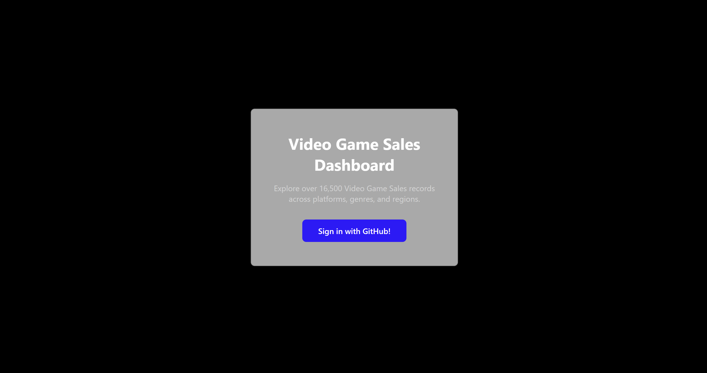
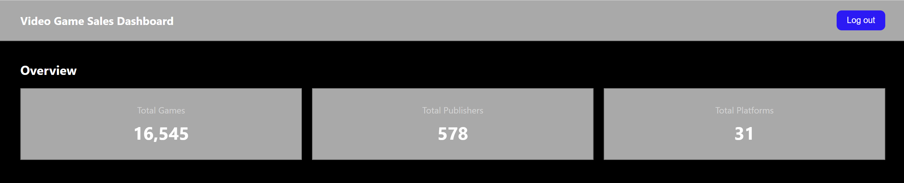
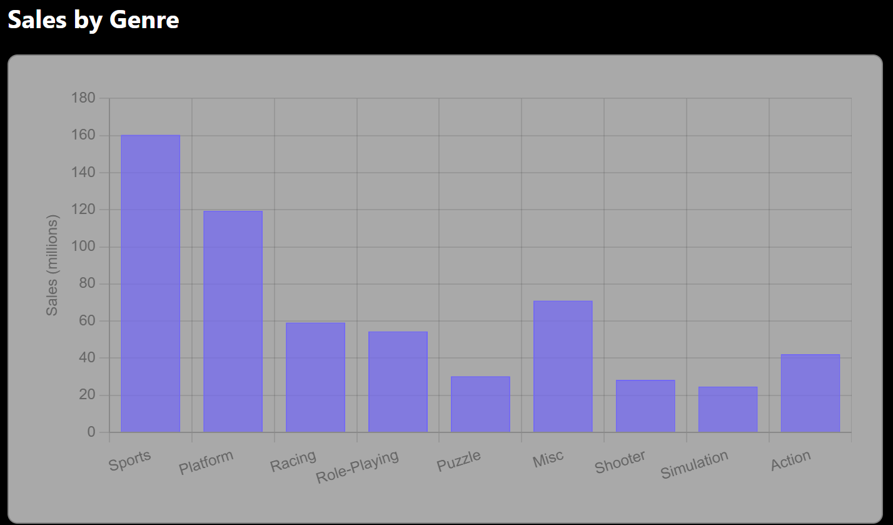
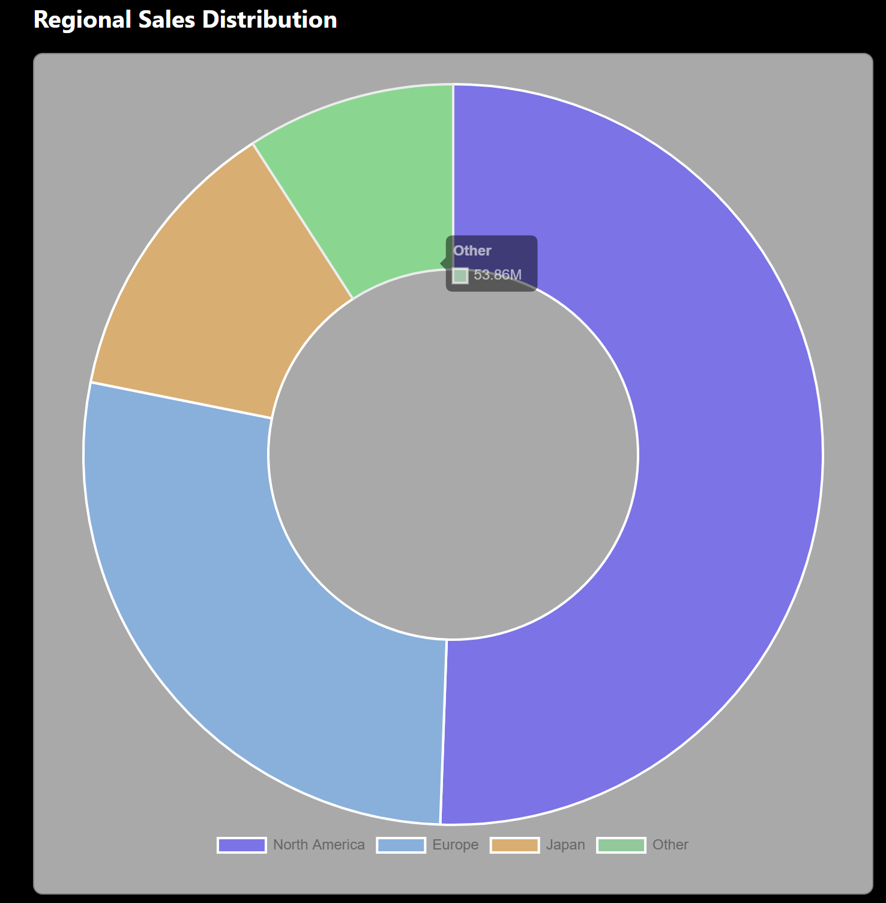
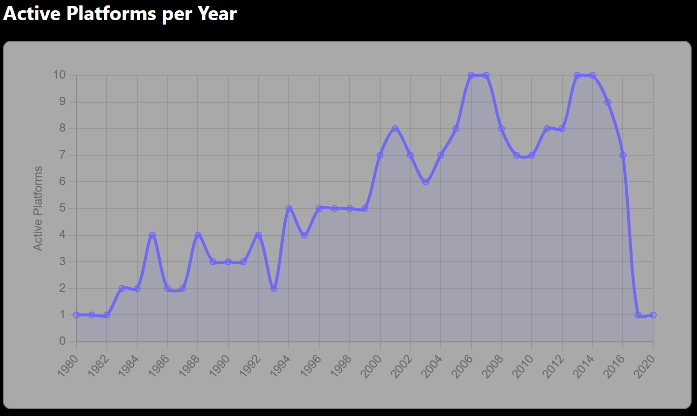
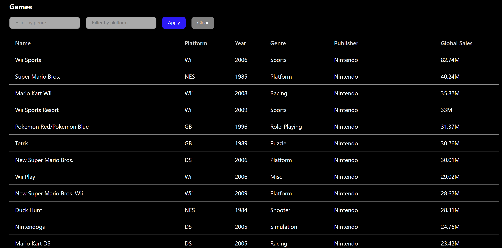

# Assignment WT - Web for Data Science

## Project Name

*Video Game Sales Dashboard*

## Objective

Create a functional, visually engaging, and *interactive* data visualization web application that consumes the API you built in the previous assignment. The application must authenticate users via OAuth and be publicly accessible.

*This application visualizes data from the Kaggle Video Game Sales dataset, which contains over 16,500 video game sales records. Users can explore sales trends across genres, platforms, and regions through interactive charts, and browse or filter the full games list with pagination.*

## Deployed Application

*Provide the link to your publicly accessible application:*

> URL: 1dv027-assignment-wt-production.up.railway.app

## Requirements

See [all requirements in Issues](../../issues/). Close issues as you implement them. Create additional issues for any custom functionality.

### Functional Requirements

| Requirement | Issue | Status |
|---|---|---|
| API Integration — the app consumes your WT1 API | [#14](../../issues/14) | :✅: |
| OAuth Authentication — users log in via OAuth 2.0 | [#15](../../issues/15) | :✅: |
| Interactive data visualization with aggregation/adaptation for 10 000+ data points | [#11](../../issues/11) | :✅: |
| Efficient loading — pagination, lazy loading, loading indicators | [#13](../../issues/13) | :✅: |

### Non-Functional Requirements

| Requirement | Issue | Status |
|---|---|---|
| Clear and well-structured code | [#1](../../issues/1) | :✅: |
| Code reuse | [#2](../../issues/2) | :✅: |
| Dependency management and scripts | [#3](../../issues/3) | :✅: |
| Source code documentation | [#4](../../issues/4) | :✅: |
| Coding standard | [#5](../../issues/5) | :✅: |
| Examiner can follow the creation process | [#6](../../issues/6) | :✅: |
| Publicly accessible over the internet | [#7](../../issues/7) | :✅: |
| Keys and tokens handled correctly | [#8](../../issues/8) | :✅: |
| Complete assignment report with correct links | [#9](../../issues/9) | :✅: |

### VG — AI/ML Feature (optional)

Not implemented!

## Core Technologies Used

| Layer | Options |
|---|---|
| **Visualization** | Chart.js | It's a simple charting library that works smoothly with vanilla Javascript. |
| **Front-end** | Vanilla JS + HTML | Plain JavaScript and HTML keeps the project simple and still fits the assignment scope. |
| **Styling** | Plain CSS | It's easy to handle, no framework was needed, and custom variables were used to maintain a consistent color theme throughout the whole application. |
| **OAuth Backend** | Express.js | Express was chosen because it was already used in the API assignment and it also handles GitHub OAuth server-side to keep the client secret secure. |
| **HTTP Requests** | node-fetch | Used to make server-side HTTP request to the GitHub OAuth API and my GraphQL API. |
| **Environment Variables** | dotenv | Used to load environment variables from .env file, which keeps secrets out of the codebase. |
| **CORS** | Allows the frontend to make requests to the Express server. |
| **Code Quality** | ESLint | Used to ensure a consistent coding standard throughout the project. |
| **Development** | nodemon | Automatically restarts the server on file changes during development. |
| **Deployment** | Railway | Used to deploy both the OAuth server and the frontend and I also used it in the API assignment because it has a simple cloud deployment, automatic restarts and HTTPS out of the box.

## How to Use

#### Logging in
Start by visiting the application and you will be asked to log in. Click on the **Sign in with GitHub!** button and you will be redirected to GitHub to approve access, you will the be automatically redirected to the dashboard. After the first login, GitHub will remember your approval and you will be take directly to the dashboard without having to approve access.

#### Overview
When you are logged in you will at the top of the dashboard find three stat cards showing the total number of games, publishers and platforms in the dataset, which gives a quick summary of how large the dataset is.

#### Charts
Below the overview you will find three interactive charts that visualize the dataset from different angles:

Hover over the charts to see exact numbers!

- **Sales by Genre:** A bar chart that shows total global sales in millions grouped by genre. Hover over a bar to see the exact sales figure for that genre.

- **Regional Sales Distribution:** A doughnut chart that breaks down sales across North America, Europe, Japan, and the rest of the world.

- **Game Releases per Year:** A line chart that show how many platforms were actively releasing games each year from 1980 to 2020.

#### Games List
At the bottom of the page you will find the full games list that shows all 16,500+ games from the dataset. The list is paginated so use the navigation buttons at the bottom to move between the pages.

You can narrow down the list using the filter inputs:
- Type a **genre** to show only games of that genre (e.g. Action, Sports, Racing).
- Type a **platform** to show only games on that platform (e.g. Wii, PS4, DS).
- The table updates automatically as you type or you can manually trigger the filter by clicking on the **Apply** button.
- Click **Clear** to remove all filters and return to the full list.

#### Logging out
When you are done, click on the **Log out** button in the top right corner. This clears your session and returns you to the login page.

## Acknowledgements
- [Video Games Sales](https://www.kaggle.com/datasets/gregorut/videogamesales)
- [Chart.js](https://www.chartjs.org/)
- [GitHub OAuth Documentation](https://docs.github.com/en/apps/oauth-apps/building-oauth-apps/authorizing-oauth-apps)
- All of the course material for this assignment
- Claude.ai

# 1DV027-Assignment-WT
